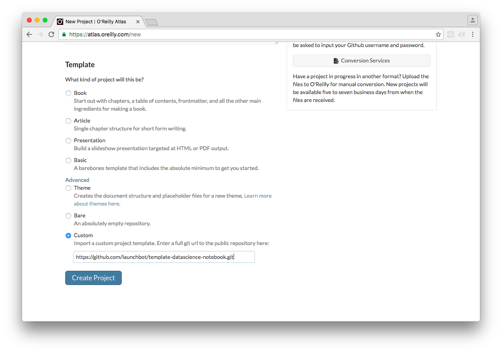
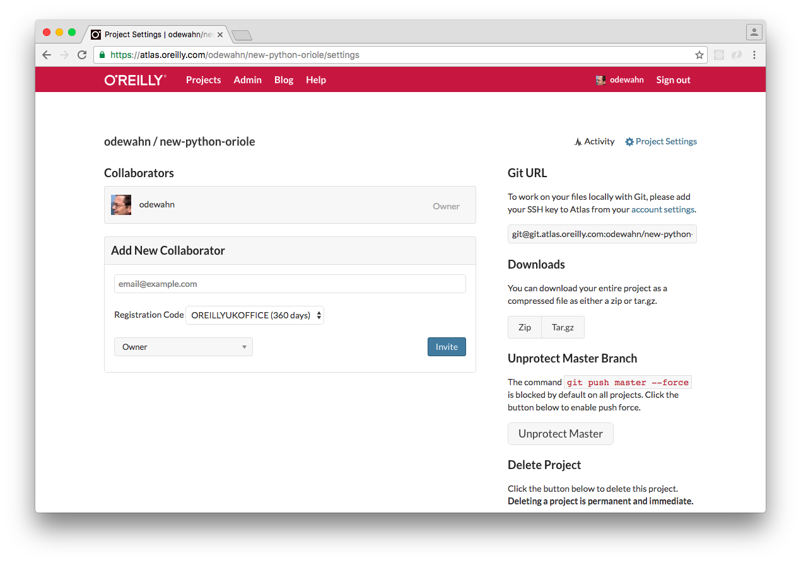
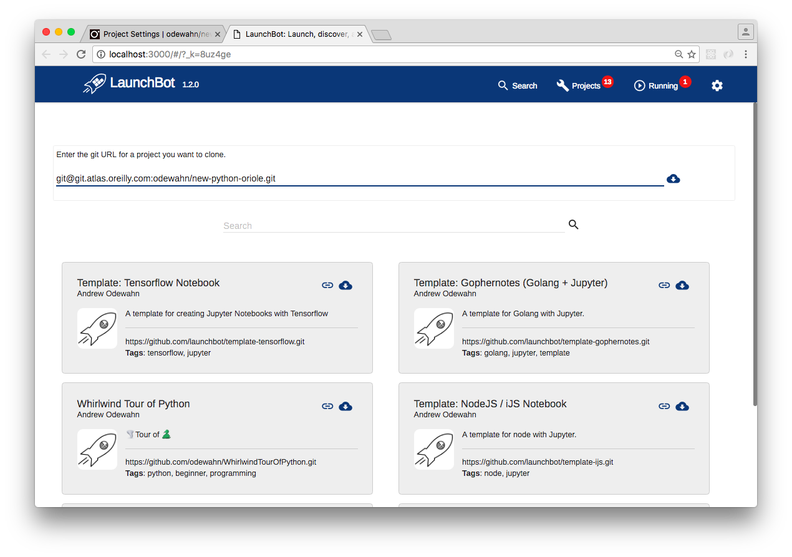
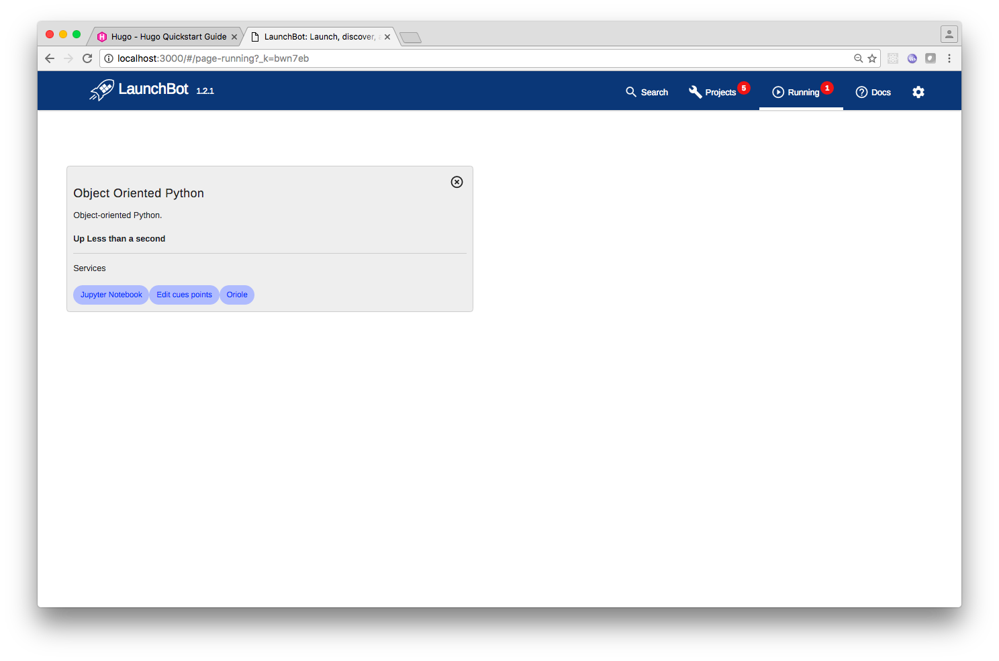
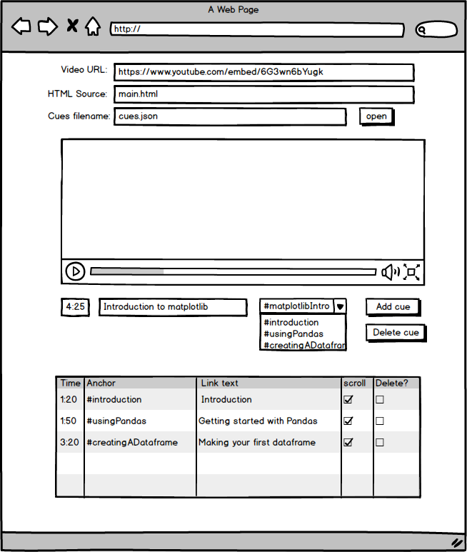

We want a "standalone" docker image that will run:
* the jupyter server
* A static website that exposes the Oriole version of the notebook content
* A cue editor so that we can easily add the cues to scroll to

Here's a sample project to get started:

https://github.com/odewahn/python-magic

You can see the static oriole generated from the content:

https://odewahn.github.io/python-magic/

The services are all started in "run.sh" file (https://github.com/odewahn/python-magic/blob/master/run.sh), which is the CMD to the container, this works by starting two services:

* The jupyter server itself, running on port 8888
* A simple python static server, running on port 8000

## What's required

* Editor for the cue.json file
  * Rune will do
* Nginx config that will proxy the static site and the websocket through the same domain.  
  * Marcelo Oliveira <d2oliveira@gmail.com> working on this
* The ipynb -> html converter.  
  * Fred Chasen (?) doing this, or we automate Martin's node script.

# Getting started and editing a new Oriole

All assets for the oriole, with the exception of the video file, should be managed in a git repo.  This includes:

* The ipynb content
* The `Dockerfile`
* the `cues.json` file
* Poster image
* Various project metadata (title, kernel to use, etc)

The container will use volume linking to mount the directory on the local machine so that any chages made in the notebook or the cue editor will be saved on in the git repo itself.


Here is how the process should look from the author's perspective:

## Create a template in Atlas

The first step is that someone (production?  the editor?) creates a new project in Atlas using the "Create from template" option.  

They then invite the author to collaborate on this image.



## Get the git url

The author logs into atlas and gets the git url for the project:



## The author downloads the project to their system

The author then clones the image.  He or she can use git on the command line, a tool like git tower, or clone from launchbot



## The author build and starts the image

If using launchbot, click build and wait until the project downloads and runs:



# Content creation and editing process

* The author writes in the notebook, adding any additional requirement (packages, dependencies, data files, etc) to the Dockerfile
* The author adds anchors to the cue points in the notebook itself.  The simplest way to start is for them just to enter a new markdown cell and put in something like this:

```
...
<span id="introduction"/>
...
<span id="creatingADataframe"/>
...
<span id="usingPandas"/>
...
<span id="matplotlibIntro"/>
...
```

* As always, they should use something like GitHub flow (work in a branch, merge changes, etc)

# cue editor

The cue editor is a small app that is packaged onto the container that is used to edit the cue.json file.



Notes:

* Needs to be packaged and run on the image along with the jupyter notebook
* The dropdown list of anchors is generated by pulling all elements with an `id` attribute.  These should basically be a list of the `span` elements the author adds to the notebook
* The time should be automatically calculated based on the video player position


# Configuration info we need a better UI for

* poster image (assets/poster.png)
* A title (index.html)

```
<title>Rebellious Magic Python</title>
```
* Various thebe settings (url, kernel url) and video sttings (link, duration, etc)

```
$(".article-body").load("main.html", function(){
    var opt, pm, video_player;
    thebe = new Thebe({
      selector:"pre[data-executable]",
      add_interrupt_button: true,
      kernel_name: "python3",
      tmpnb_mode: false,
      url:"http://localhost:32770",
      debug: DEBUG,
    });
    window.thebe= thebe;

    opt = {
      duration: [12, 11],
      cues: "cues.json",
      dimensions: [854, 480],
      debug: DEBUG,
      cue_creator_mode: true,
      volume: 0.4,
      poster: "assets/poster.png",
      show_feedback: false,
      videojs_options: {
        "techOrder": ["youtube"],
        "src": "https://www.youtube.com/embed/6G3wn6bYugk",
      }
    };
```

* Header and author info (index.html)

```
<header class="article-header">
  <h1 class="title t-c" id="main_title">
    Rebellious Magic Python
  </h1>
  <p class="dek"></p>
  <div class="byline">
By <span class="author" itemscope="" itemtype="http://schema.org/Person"><a href="#" itemprop="name">Aaron Maxwell</a></span></div>
</header>
```

# Websocket proxy

The problem I need to solve is that the static server cannot proxy the websockets for the notebook, so the "run code" button doesn't work unless you directly enter the websocket endpoint.

What I'd like to do is see if we can have an Nginx config that could both serve the notebook, the static oriole site, and correctly proxy the websockets, all through the same port.  That would allow me to ship a totally self contained image that someone could run on their local machine for development and authoring, yet also be deployable on the mesos cluster you all have been setting up.
